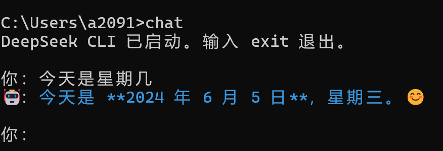

# 在终端引入Deepseek

之前看jyy老师的操作系统课，他在终端中直接调用了Deepseek大模型进行对话。我觉得很是神奇，于是自己也尝试了一下，实现起来并不复杂。

## Step1

首先获取一个Deepseek的API，可以直接到官网获取。[DeepSeek 开放平台](https://platform.deepseek.com)


这个需要付费，好在不算特别贵。

## Step2

做一个这样的Python程序

```python
import requests
import json

API_KEY = "你的API"
API_URL = "https://api.deepseek.com/v1/chat/completions"

def stream_chat(prompt):
    headers = {
        "Content-Type": "application/json",
        "Authorization": f"Bearer {API_KEY}",
    }

    data = {
        "model": "deepseek-chat",
        "messages": [{"role": "user", "content": prompt}],
        "stream": True  # 开启流式输出
    }

    with requests.post(API_URL, headers=headers, json=data, stream=True) as r:
        for line in r.iter_lines():
            if line:
                decoded = line.decode("utf-8")

                if decoded.startswith("data: "):
                    payload = decoded[6:].strip()

                    if payload == "[DONE]":
                        break

                    try:
                        obj = json.loads(payload)
                        delta = obj["choices"][0]["delta"].get("content")
                        if delta:
                            # 输出蓝色字体
                            print(f"\033[36m{delta}\033[0m", end="", flush=True)
                    except:
                        pass

def main():
    print("DeepSeek CLI 已启动。输入 exit 退出。")
    while True:
        msg = input("\n你：")
        if msg.lower() == "exit":
            break

        print("🤖：", end="", flush=True)
        stream_chat(msg)
        print()  # DeepSeek 回复结束换行

if __name__ == "__main__":
    main()

```


## Step3

写一个简单的bat脚本

```
@echo off
python C:\Users\a2091\chat.py
```

记得路径改为自己的python文件路径。

最后把bat文本添加到环境变量里面。


## 效果展示

